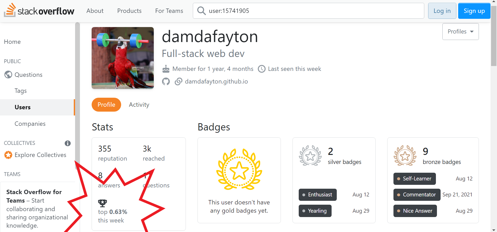
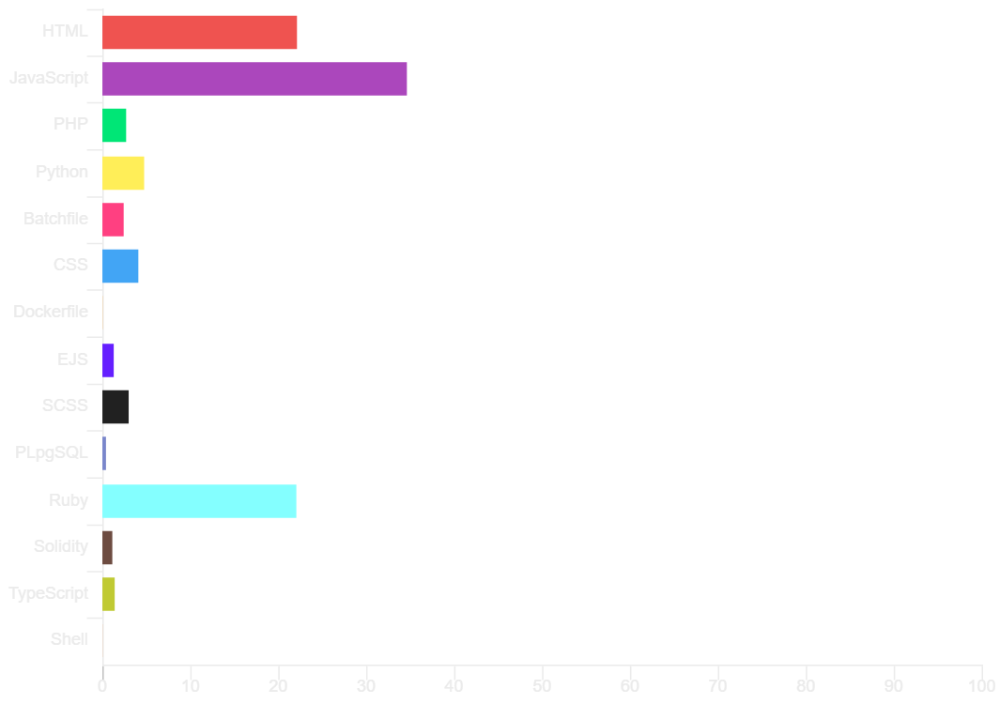

<!-- 

 -->

## puts skills = [

<section style="font-family: Arial;">

"Motto: Don't Repeat Yourself",

"Front-end: HMTL, CSS, SASS, Bootstrap, MaterialUI, React, Redux-Toolkit-RTK Query",

"Back-end: Node/Express, Ruby/Rails, Python/Django, PHP7, WorkBox",

"Frameworks: Bootstrap, React, Node/Express, Brownie",

"Database: MongoDB, PostgreSQL, MySQL, Prisma",

"Testing: Chai, Jest, Puppeteer, Supertest, RSpec, RSwag, Pry",

"Blockchain: Solidity, Hardhat, Brownie",

 

"Tools: Git, Postman, Docker"

]

</section>

<!--
**damdafayton/damdafayton** is a ✨ _special_ ✨ repository because its `README.md` (this file) appears on your GitHub profile.

Here are some ideas to get you started:
-->

<!-- - 🔭 I’m currently working on laptop
- 🌱 I’m currently learning many things
- 👯 I’m looking to collaborate on something
- 🤔 I’m looking for help with anything
- 💬 Ask me about nothing
- 📫 How to reach me: github?
- 😄 Pronouns: are important
- ⚡ Fun fact: first computer bug was literally a bug 🐛
 -->

<!-- ## if doICodeClean?

#### # Instead of this

#### # I prefer this

end -->

---

<!--   <a target="_blank" href="http://www.codewars.com/users/damdafayton">Codewars</a> -  -->
&nbsp;&nbsp;&nbsp;

 
 

