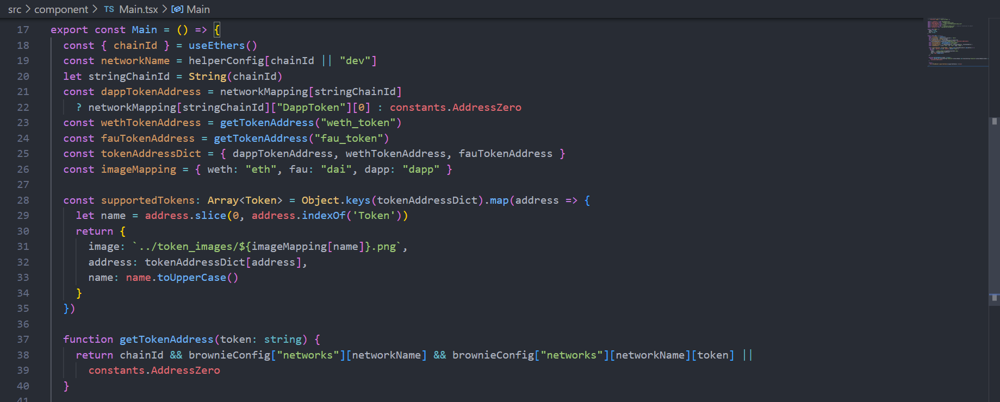

<!-- 

 -->

## puts skills [
<section style="font-family: Arial;">

{ :Motto => "Don't Repeat Yourself" },

{ :Languages => "HMTL, CSS, SASS, JavaScript, Python, Ruby, Solidity" },

{ :Frameworks => "Bootstrap, React, Jest, Node/Express, Brownie" },

{ :Databases => "MongoDB, PostgreSQL" },

{ :Libraries => "Git, Redux, WorkBox" },

 

{ :Tools => "Webpack, Rspec, Pry" }

</section>
]
<!--
**damdafayton/damdafayton** is a ✨ _special_ ✨ repository because its `README.md` (this file) appears on your GitHub profile.

Here are some ideas to get you started:
-->
<!-- - 🔭 I’m currently working on laptop
- 🌱 I’m currently learning many things
- 👯 I’m looking to collaborate on something
- 🤔 I’m looking for help with anything
- 💬 Ask me about nothing
- 📫 How to reach me: github?
- 😄 Pronouns: are important
- ⚡ Fun fact: first computer bug was literally a bug 🐛
 -->

## if doICodeClean?

end

---

<!--   <a target="_blank" href="http://www.codewars.com/users/damdafayton">Codewars</a> -  -->
  
 

